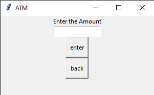

# Read Me
This Python project is a simple graphical ATM interface built using the Tkinter library. The application allows users to perform basic banking operations like withdrawing funds, depositing money, and checking their account balance.
# Usage
run " python ATM.py " in terminal
# Example

## Author 
Furkan Sarsilmaz